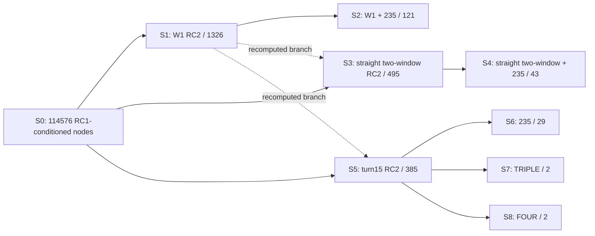

# R3_FINAL_TECHNICAL_ARCHITECTURE

UTC: 2026-09-30

Canonical sync: 2026-10-02。参数候选集审计获 GPT 独立审计通过，R3 冻结；本次同步没有运行数值或物理计算。

## 主线架构

$$
\boxed{
\text{RC1 会聚区环境先验}
\rightarrow
\text{RC2 连续方位/平台运动维持运动学候选}
\leftrightarrow
\text{RC3 多频相对传播形状约束}
\rightarrow
\text{小转向形成虚拟基线}
\rightarrow
\text{跨频别名互补切断距离脊线}
\rightarrow
\text{输出四维主状态候选集合}
}
$$

## 状态定义

$$
x = [r, \theta, z, v, \psi]^T
$$

处理结构：

```text
main tracking state = [r, theta, v, psi]
z = PROFILED_NUISANCE_VARIABLE
scientific depth role = MIXED_OR_UNRESOLVED
```

**禁止**写成：`single-array one-shot five-parameter inversion`

## 模块说明

| 模块 | 功能 | 状态 |
|---|---|---|
| RC1 | 会聚区环境先验（E-STD Munk, H=5000m） | 已验证 |
| RC2 | 连续方位 + 平台运动 → 运动学候选云 | 已验证 |
| RC3 | 多频相对 TL 形状 → profiled margin | 已验证 |
| 转向 | 小幅平台转向形成虚拟基线 | 已验证（15°） |
| 多频 | 跨频别名互补切断 r-z 脊线 | 已验证 |

## 处理流程

RC1 初始化冻结的 RC1-conditioned 搜索网格。RC2 在各观测支路维持候选云，RC3对相应候选云评分；不同支路和声学配置之间不构成一条连续筛选链。

## 最终候选收缩 DAG

下图中的候选数使用 z_true=200 m；三深度的完整结果保留在[参数候选质量表](../R3_FINAL_PARAMETER_CONTRACTION/PARAMETER_CONTRACTION_BY_DEPTH_FIXED.csv)。



S3、S5 从全网格重算各自支路；S1 对它们的子集关系已按 node_id 审计，不能把数量关系解释为声学递归。S6/S7/S8 是同一 S5 的385节点 RC2云上的并行声学配置，S7、S8 均以 S5为 parent。完整边关系见[冻结分支图](../R3_FINAL_PARAMETER_CONTRACTION/PARAMETER_CONTRACTION_GRAPH.csv)。

| 支路（z_true=200 m） | RC2云 | 声学约束后 | 距离投影与四维连通性 |
|---|---|---|---|
| 单窗口 | S1：1326 | S2：121 | 全16距离格；1个4D连通分量 |
| 直航双窗口 | S3：495 | S4：43 | 全16距离格；1个4D连通分量 |
| 15°转向 + 235 | S5：385 | S6：29 | 15个占用距离格、bbox含16格；4个4D分量、2个距离分区 |
| 15°转向 + TRIPLE | S5：385 | S7：2 | 50 km单格；1个4D分量 |
| 15°转向 + FOUR | S5：385 | S8：2 | 50 km单格；1个4D分量 |

## 冻结输出与口径

S7/S8 在 z_true=180/200/220 m 均保留 `(50 km,0°,2 m/s,4°)` 与 `(50 km,0°,2 m/s,5°)`。距离、初始方位、速度均为单格，剩余维度为psi；两个节点只相差一个航向网格步长，形成一个连通分量。

within frozen 114576-node RC1-conditioned discrete grid:

```text
final S7/S8 survivor count = 2
excluded fraction = 99.998254%
RC1_contraction_ratio = NOT_IDENTIFIABLE
```

真值在六个 matched case 中均为唯一最优节点；全集合最坏航向相对诊断为20%，统一<10%集合界未建立。`DIAGNOSTIC_ONLY_NOT_REQUIREMENT_VERIFICATION`。z仍为profile nuisance；后续递归更新及端到端海试不属于本次已验证输出。

R3 当前总体标签与冻结状态以[最终判定](R3_FINAL_DECISION.json)为准。历史参数审计文件保留审计当时的 provisional 标签，作为带日期的证据快照；当前已由用户提供的 GPT 独立审计接受，不再表示待审计。
