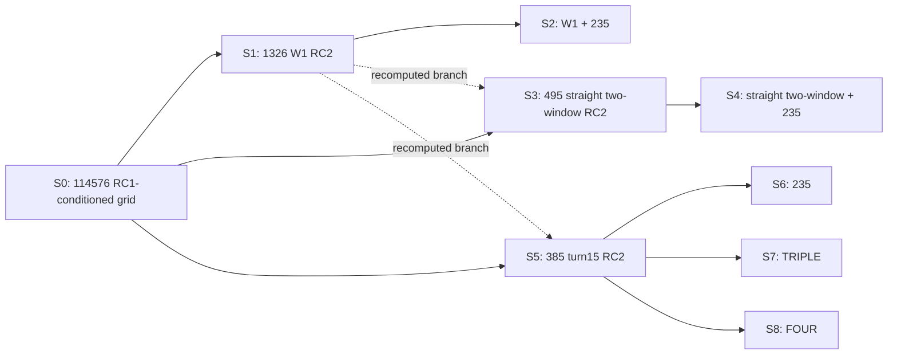

# R3 PARAMETER-CONTRACTION AUDIT-FIX

Baseline: `e2debd48bf11dfbb3a16c1461b808affe56b869d`. Generated UTC: 2026-10-02T04:08:57.496243+00:00.

`PARAMETER_CONTRACTION_AUDIT_COMPLETE` applies to this data audit. Overall status remains
`R3_CLOSEOUT_PROVISIONAL_PENDING_GPT_FINAL_AUDIT`; P5 is not opened.

## Branch semantics



S6/S7/S8 are parallel configurations on the same S5 cloud. Set overlaps do not
establish serial filtering. Every graph edge uses actual node IDs. S7/S8 both
use S5 for contraction_from_previous. The nine-row overview uses z=200m for
display only; the authoritative depth table has all 15 scored stage/depth cases.

```text
stage  z_true  n_candidates  r_width  theta_width  v_width  psi_width  truth_rank_min  n_tied_with_truth
   S2   180.0           122     15.0          0.0      0.4        8.0             1.0                1.0
   S2   200.0           121     15.0          0.0      0.2        8.0             1.0                1.0
   S2   220.0           137     15.0          0.0      0.8        8.0             1.0                1.0
   S4   180.0            41     15.0          0.0      0.0        3.0             1.0                1.0
   S4   200.0            43     15.0          0.0      0.2        3.0             1.0                1.0
   S4   220.0            41     15.0          0.0      0.0        3.0             1.0                1.0
   S6   180.0             2      4.0          0.0      0.0        0.0             1.0                1.0
   S6   200.0            29     15.0          0.0      0.2        2.0             1.0                1.0
   S6   220.0            15     15.0          0.0      0.0        1.0             1.0                1.0
   S7   180.0             2      0.0          0.0      0.0        1.0             1.0                1.0
   S7   200.0             2      0.0          0.0      0.0        1.0             1.0                1.0
   S7   220.0             2      0.0          0.0      0.0        1.0             1.0                1.0
   S8   180.0             2      0.0          0.0      0.0        1.0             1.0                1.0
   S8   200.0             2      0.0          0.0      0.0        1.0             1.0                1.0
   S8   220.0             2      0.0          0.0      0.0        1.0             1.0                1.0
```

## Multimodality and occupancy

4D adjacency is Manhattan distance 1 on integer grid coordinates, with frozen
steps (1km, 0.5deg, 0.2m/s, 1deg), without boundary wrapping. Range components
are separate contiguous runs of the range projection. A connected range
projection alone does not prove 4D connectivity. Component sizes partition every cloud.

```text
stage  z_true  n_candidates  n_connected_components  largest_component_size  n_range_components
   S0     NaN        114576                       1                  114576                   1
   S1     NaN          1326                       1                    1326                   1
   S2   180.0           122                       1                     122                   1
   S2   200.0           121                       1                     121                   1
   S2   220.0           137                       2                     132                   1
   S3     NaN           495                       1                     495                   1
   S4   180.0            41                       1                      41                   1
   S4   200.0            43                       1                      43                   1
   S4   220.0            41                       1                      41                   1
   S5     NaN           385                       1                     385                   1
   S6   180.0             2                       2                       1                   2
   S6   200.0            29                       4                      18                   2
   S6   220.0            15                       5                       5                   5
   S7   180.0             2                       1                       2                   1
   S7   200.0             2                       1                       2                   1
   S7   220.0             2                       1                       2                   1
   S8   180.0             2                       1                       2                   1
   S8   200.0             2                       1                       2                   1
   S8   220.0             2                       1                       2                   1
```

Bounding spans include missing internal bins. S6/z=200m has 15 occupied range bins,
16 bbox range bins, N_bbox=96, bbox fraction=0.000837871805614,
correlation_sparsity=0.302083333333. Occupied-product uses separate fields.

## Final candidate quality

All six S7/S8 cases are generated from raw scores and cross-checked against the
existing survivor CSV. The final per-case states are in the decision JSON; the
candidate-level table includes J, profiled z, full-state truth flags and ranks.
First case (all others are separately audited):

```json
{
  "stage": "S7",
  "subset": "201+235+283",
  "z_true": 180.0,
  "states": [
    {
      "r": 50.0,
      "theta": 0.0,
      "v": 2.0,
      "psi": 4.0
    },
    {
      "r": 50.0,
      "theta": 0.0,
      "v": 2.0,
      "psi": 5.0
    }
  ]
}
```

Remaining dimensions: ["psi"]. Excluded fraction=0.999982544337
(about 99.998254%) **within the frozen 114576-node RC1-conditioned discrete search grid**.
`RC1_CONTRACTION_RATIO = NOT_IDENTIFIABLE_FROM_CURRENT_EXPERIMENT`.

`final_nominal_universal_lt10pct_set_bound=NOT_ESTABLISHED` uses only S7/S8 x all three depths.
Worst full-survivor relative diagnostic=20.0%; theta uses absolute error (truth=0).
The relative r/v/psi diagnostic uses strict <10%; theta absolute error is reported
separately, with no new acceptance threshold. A relative theta bound is undefined. This is
`DIAGNOSTIC_ONLY_NOT_REQUIREMENT_VERIFICATION`.
`top1_truth_exact_in_matched_synthetic_control=True` is a separate score result.
Truth rank counts all parent-cloud scores; better means J<J_truth; ties include
truth and use exact serialized equality, without a new numerical tolerance.

## Stress quality

144 cases: 96 amplitude, 30 tracked-frequency FIX2, 18 SSP, including controls.
Each case reports four parameter spans, occupied bins, worst truth errors,
full-state truth retention/rank and global-best range bins. Missing theta columns
are joined by node_id to verified S5 coordinates; r/v/psi and the frozen flattened
grid ID are checked. Range-only truth surrogates are not used.
Amplitude A=2dB has only a prior summary, no candidate-level scores in this input,
and is outside this four-dimensional audit. No absent cases are simulated.

```text
       stress_type   level config  n_cases  strict_count  rank1_count  truth_retained_count  max_r_width  max_theta_width  max_v_width  max_psi_width  max_rel_err_r  max_abs_err_theta  max_rel_err_v  max_rel_err_psi
         amplitude     0.0   FOUR       12            12           12                    12          0.0              0.0          0.0            1.0           0.00                0.0            0.0              0.2
         amplitude    0.25   FOUR       12             8           12                    12          1.0              0.0          0.0            1.0           0.02                0.0            0.0              0.2
         amplitude     0.5   FOUR       12             6           12                    12          2.0              0.0          0.0            1.0           0.04                0.0            0.0              0.2
         amplitude     1.0   FOUR       12             1           12                    12         15.0              0.0          0.0            1.0           0.20                0.0            0.0              0.2
         amplitude     0.0 TRIPLE       12            12           12                    12          0.0              0.0          0.0            1.0           0.00                0.0            0.0              0.2
         amplitude    0.25 TRIPLE       12            11           12                    12          1.0              0.0          0.0            1.0           0.02                0.0            0.0              0.2
         amplitude     0.5 TRIPLE       12             6           12                    12          1.0              0.0          0.0            1.0           0.02                0.0            0.0              0.2
         amplitude     1.0 TRIPLE       12             1           12                    12         15.0              0.0          0.0            1.0           0.20                0.0            0.0              0.2
tracked_freq_drift     0.0   FOUR        3             3            3                     3          0.0              0.0          0.0            1.0           0.00                0.0            0.0              0.2
tracked_freq_drift  0.0025   FOUR        3             3            3                     3          0.0              0.0          0.0            0.0           0.00                0.0            0.0              0.0
tracked_freq_drift   0.005   FOUR        3             3            3                     3          0.0              0.0          0.0            1.0           0.00                0.0            0.0              0.2
tracked_freq_drift    0.01   FOUR        3             3            3                     3          0.0              0.0          0.0            1.0           0.00                0.0            0.0              0.2
tracked_freq_drift    0.02   FOUR        3             3            3                     3          0.0              0.0          0.0            1.0           0.00                0.0            0.0              0.2
tracked_freq_drift     0.0 TRIPLE        3             3            3                     3          0.0              0.0          0.0            1.0           0.00                0.0            0.0              0.2
tracked_freq_drift  0.0025 TRIPLE        3             3            3                     3          0.0              0.0          0.0            1.0           0.00                0.0            0.0              0.2
tracked_freq_drift   0.005 TRIPLE        3             3            3                     3          0.0              0.0          0.0            1.0           0.00                0.0            0.0              0.2
tracked_freq_drift    0.01 TRIPLE        3             3            3                     3          0.0              0.0          0.0            1.0           0.00                0.0            0.0              0.2
tracked_freq_drift    0.02 TRIPLE        3             3            3                     3          0.0              0.0          0.0            1.0           0.00                0.0            0.0              0.2
      ssp_mismatch      E0   FOUR        3             3            3                     3          0.0              0.0          0.0            1.0           0.00                0.0            0.0              0.2
      ssp_mismatch      E1   FOUR        3             0            0                     2         14.0              0.0          0.6            2.0           0.18                0.0            0.2              0.2
      ssp_mismatch      E2   FOUR        3             0            0                     2         14.0              0.0          0.0            1.0           0.20                0.0            0.0              0.2
      ssp_mismatch      E0 TRIPLE        3             3            3                     3          0.0              0.0          0.0            1.0           0.00                0.0            0.0              0.2
      ssp_mismatch      E1 TRIPLE        3             0            0                     2         15.0              0.0          0.4            2.0           0.20                0.0            0.1              0.2
      ssp_mismatch      E2 TRIPLE        3             0            0                     2         14.0              0.0          0.4            2.0           0.20                0.0            0.2              0.2
```

## Reproducibility

Run `python r3_final_parameter_contraction_fix.py`; the old entry point forwards here.
STRESS_METRIC_REGRESSION.csv verifies previous range widths, truth ranks, retention
and strict range-anchor metrics for every stress case (144/144 each).
AUDIT_SOURCE_MANIFEST.csv records hashes and row counts. AUDIT_INTEGRITY_CHECKS.csv
contains 248 passing checks. Source SHA256 values were verified unchanged.
Legacy filenames contain corrected tables to supersede the linear-chain and bbox errors.
No propagation, physical scenario, threshold, truth, seed or turn was changed.
