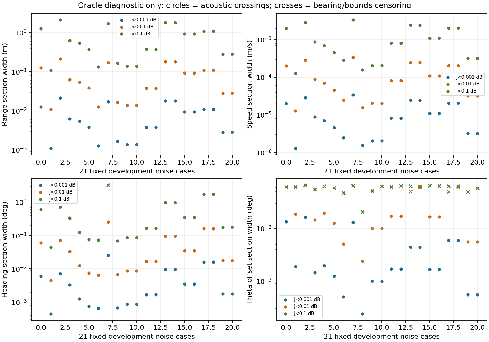
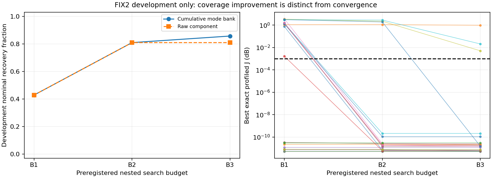

# R4-A1-FIX2 acoustic coverage

**A1_FIX2_BLOCKED_BY_UNCLOSED_ACOUSTIC_COVERAGE; R4 progress 0%.** R3, original A1 and FIX1 evidence remain frozen. All original regression and Q holdout cases are development evidence. This repair does not execute a multi-sigma accuracy experiment or claim an engineering bearing tolerance.

## Quantitative landscape

Oracle truth is used only for feasible local landscape characterization, never estimator starts. The local coordinates are r,v,psi with observation-profiled theta plus the truth's fixed profile offset; the independent theta-offset direction changes theta. Coupled SVD directions use declared normalized scales. Every scored diagnostic perturbation is inside the unchanged continuous bearing likelihood. Noiseless full-rank bearing observations define a numerical singleton, and their zero widths are explicitly not acoustic widths.

Uncensored J<0.001 dB cross-section widths (r entries below are metres; other units are m/s or degrees):

| direction | threshold_db | min | median | max |
| --- | --- | --- | --- | --- |
| psi_deg | 0.001 | 0.0004439566 | 0.001772862 | 0.02558436 |
| r_m | 0.001 | 0.001076273 | 0.005368194 | 0.02119005 |
| theta_offset_deg | 0.001 | 0.0002379855 | 0.001701519 | 0.01638471 |
| v_mps | 0.001 | 1.267457e-06 | 8.097813e-06 | 3.35387e-05 |

Full J<0.001/0.01/0.1 dB boundaries, bearing-censored intervals, nuisance-depth interactions and Hessian/sensitivity directions are exported. Normalized sensitivity condition numbers range from 160519 to 666320 (median 339076); the fastest coupled direction is dominated by normalized range (median absolute loading 0.9961), with speed coupling. Independent axis widths are not a four-dimensional rectangular basin volume. The old 42 DE islands all exhausted their budgets. A uniform-draw N^-1/4 spacing calculation is an illustrative reference only, not a probability model or coverage certificate for correlated DE trajectories. Millimetre-scale range sections are orders of magnitude narrower than coarse global proposal spacing. Local refinement is therefore essential, and successful local convergence alone cannot establish that all basins were proposed.

Truth-state spline/exact discrepancies across all 15 old truths are at most 3.72e-6 dB, below the 0.001 dB criterion. This diagnostic rules out interpolation error at those truth points as the cause of the large remaining failures; it does not certify every proposal point.

No profiled-depth label switch occurs at the measured old-panel section walls at these three thresholds. Bearing/state-bound censoring affects 91 of the 504 noisy direction/threshold intervals (including coupled directions), and those limits are not interpreted as acoustic basin boundaries.

## Coverage architecture and budgets

See FIX2_METHOD.md, SEARCH_BUDGET_PREREGISTRATION.json and METHOD_FREEZE.json. Nested deterministic range/radial meshes are continued by observed bearing into theta/tangential speed. All shared-depth branches retain separated proposals, then analytic-Jacobian local refinement and direct-modal polishing run. Lower-budget candidates are preserved cumulatively. Raw component results are exported separately; retaining an earlier success is not by itself evidence of independent fine-resolution convergence. Jacobians agree with finite differences and exact forward features.

Cumulative retention was introduced during development after observing that a finer raw component could discard a basin already recovered at a lower budget. This is an adaptive development change to candidate aggregation, not a preregistered independent convergence success. The preregistered component meshes, starts, tolerances and threshold remain unchanged; raw component caches are preserved. Fresh confirmation uses the final frozen hierarchy and aggregation rule.

The grid covers r=45--60 km and radial target speed=0.94--3 m/s. It samples bearing-profile centers and locally refines all four coordinates; it is not a certified exhaustive partition of the entire four-dimensional likelihood region. Finite depth-branch beams can miss a narrow basin. The finest bank is computed once, and masked nested subsets used for budget experiments. Logical node/start counts and shared-cache runtime are distinguished. The original nine regression ranges happen to lie on the 10 m finest range mesh because those historical truths were specified to two decimals in km; the method does not use their coordinates to position the mesh. The Q panel and fresh full-precision random panel do not share this coincidence, so the regression results alone would be insufficient confirmation.

Nominal development recovery vs budget:

| budget | n_cases | recovered | raw_component_recovered | exact_J_P50 | exact_J_worst | recovery_fraction | scope |
| --- | --- | --- | --- | --- | --- | --- | --- |
| B1 | 21 | 9 | 9 | 0.7481413 | 3.631803 | 0.4285714 | ALL_PRIOR_PANELS_ARE_DEVELOPMENT |
| B2 | 21 | 17 | 17 | 1.878389e-11 | 2.833546 | 0.8095238 | ALL_PRIOR_PANELS_ARE_DEVELOPMENT |
| B3 | 21 | 18 | 17 | 1.528524e-11 | 0.9748876 | 0.8571429 | ALL_PRIOR_PANELS_ARE_DEVELOPMENT |

Stable B2/B3 cumulative states: 17/21; raw B2/B3 components both recovered: 16/21. All case-level exact J, coordinates, circular errors, candidate envelopes, bearing costs/cutoffs, basin counts and budgets are in SEARCH_BUDGET_CONVERGENCE.csv and candidate catalogs.

Development B3 hierarchy recovery: noiseless 15/15, nominal 18/21, total 33/36. Remaining failed cases: P02_s0.1_seed410001, P09_s0.1_seed410001, Q06_s0.1_seed420001.

## Independent global family

Five preselected difficult failures plus two additional development failures (P02/Q06, selected after development results and before fresh confirmation) use the same independent Sobol bank and derivative-free Nelder-Mead refinement in radial coordinates, without primary recovered-state initialization. INDEPENDENT_SUPPLEMENT_DESIGN.json makes the adaptive diagnostic selection explicit. Agreement checks exact score, four coordinates, nuisance depth and bearing feasibility.

| case_id | exact_J | primary_exact_J | agreement | differences |
| --- | --- | --- | --- | --- |
| P09_s0.1_seed410001 | 2.598187e-07 | 0.005087173 | False | [2.252119684698073e-05, 0.02082439479426057, 0.0009630358515799742, 0.4295007949566241] |
| P06_s0.1_seed410001 | 6.784404e-08 | 1.939005e-11 | True | [2.4430590883639525e-10, 4.6852449031575816e-08, 1.1589154969016136e-08, 1.9402432371862233e-06] |
| P04_s0.1_seed410001 | 9.934309e-08 | 1.862169e-11 | True | [1.1726086768248933e-10, 1.1679788656238088e-06, 5.9225697457421234e-08, 2.095865571050126e-05] |
| Q01_s0.1_seed420001 | 0.8889702 | 2.11922e-10 | False | [1.714668859774676, 0.07930014384874084, 0.010180774804551262, 3.183566947316848] |
| Q04_s0.1_seed420001 | 3.464452e-08 | 1.491463e-11 | True | [4.46966907929891e-10, 3.9787519767742197e-07, 1.217987710688817e-08, 3.045601999929204e-06] |
| P02_s0.1_seed410001 | 0.9427843 | 0.9748876 | False | [0.5505474235372034, 0.06433605396350117, 0.01583307139399781, 0.2663897329552185] |
| Q06_s0.1_seed420001 | 1.059455e-07 | 0.02086257 | False | [5.497054308989391e-05, 0.04939980544438072, 0.004092126764176696, 1.8111964327068222] |

Independent matched-basin recovery is 5/7; agreement with the primary method is 3/7. P09 and Q06 have independently recovered near-zero basins missed by the primary hierarchy; Q01 shows the reverse failure. These disagreements are search-coverage findings, not evidence of physical aliases.

## Fresh preregistered confirmation

Method/config/code hashes and B3 hierarchy were frozen first. Only then were eight new interior off-grid truths generated from seed 2026100204 and their panel/design hashes frozen before observations. Each truth has noiseless and nominal seeds 430001/430002; no panel editing or threshold changes follow results.

Noiseless recovery 8/8; nominal recovery 13/16. See FRESH_HOLDOUT_RESULTS.csv for every result; failures remain visible. J<0.001 dB and continuous bearing feasibility are required unchanged. FRESH_BASIN_GEOMETRY.csv contains post-confirmation oracle section diagnostics with the same three thresholds; these measurements never feed the frozen estimator.

## Decision and limits

`{"ACOUSTIC_BASIN_GEOMETRY_CHARACTERIZED": true, "GLOBAL_SEARCH_COVERAGE_CONVERGENCE_VALIDATED": false, "DEVELOPMENT_MATCHED_BASINS_RECOVERED": false, "INDEPENDENT_SEARCH_AGREEMENT_CONFIRMED": false, "FRESH_HOLDOUT_MATCHED_BASINS_RECOVERED": false, "NO_UNRESOLVED_EXACT_CONTINUOUS_ALIAS_IN_TESTED_CONTROLS": true}`

Positive exact J while matched truth remains in the bearing region is a finite-search failure. No physical non-identifiability is inferred from failed optimization. ALIAS_DIAGNOSTIC.csv tests separated exported states against exact joint tolerances (bearing RMS 1e-8 degree and acoustic RMS 1e-6 dB); absence of an exported alias is not a proof of global uniqueness under noise.

R4 remains 0% even if this repair passes. Full A1 can resume only after an accepted repair Gate; unresolved coverage or convergence blocks that route. No A2/nav/SSP/amplitude joint sweep, depth estimator or P5 is opened.

## Reproduction and local validation

`python r4_a1_fix2_coverage.py geometry`, `development`, `pool`, `independent`, `freeze`, `holdout` reproduce the isolated stages. `python r4_a1_fix2_audit.py` reconstructs numerical evidence, checks frozen bytes and method/code hashes, and verifies exact aliases. `python r4_a1_fix2_report.py` generates this report/decision and scientific figures from saved data only. Cache records preserve raw per-case starts, optimizer status and candidates. LOCAL_VALIDATION.md states the actual check counts and scope. Independent research-lead audit is pending.
