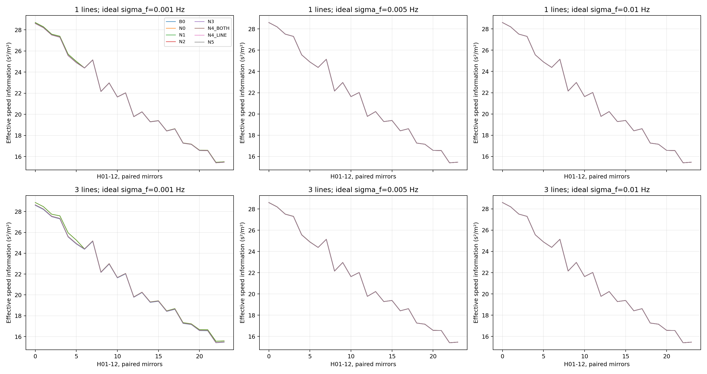
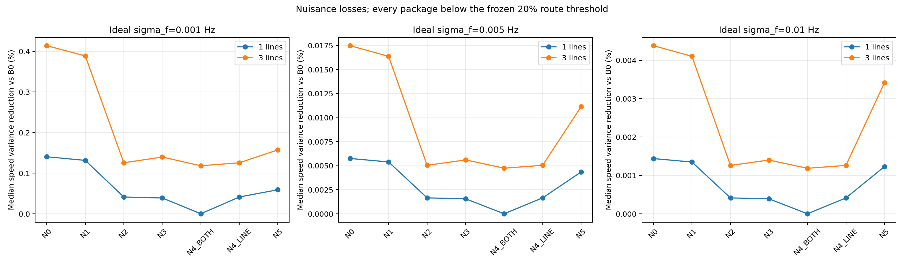

# E1-G0 未知量剖面后的频率信息验证

E1_G0_FREQUENCY_INCREMENT_NOT_ESTABLISHED

已复用H01–H12与双镜像24场景，1896条全量记录；无MC、录音、频率实际提取、传播或优化器运行。没有因Sun完整估计器未锁而停止观测机制研究。

24场景为既有5km固定全局横向布放的 nominal beta=0 控制；不代表500个保存随机布放的完整统计覆盖。原方位随机RMS0.05°、共模±0.05°、差模半差±0.025°、导航25m/轴均保留为局部Gaussian/二阶矩条件。

| 模型 | 单线：0.001 / 0.005 / 0.010 Hz，中位改善% | 三线：同档中位改善% |
|---|---|---|
| N0 | 0.140461 / 0.005754 / 0.001439 | 0.414044 / 0.017482 / 0.004381 |
| N1 | 0.131537 / 0.005390 / 0.001349 | 0.388864 / 0.016369 / 0.004104 |
| N2 | 0.041362 / 0.001656 / 0.000414 | 0.125681 / 0.005043 / 0.001261 |
| N3 | 0.038952 / 0.001559 / 0.000390 | 0.139787 / 0.005604 / 0.001401 |
| N4_BOTH | 0.000011 / 0.000000 / 0.000000 | 0.118291 / 0.004745 / 0.001186 |
| N4_LINE | 0.041362 / 0.001656 / 0.000414 | 0.125681 / 0.005043 / 0.001261 |
| N5 | 0.059203 / 0.004352 / 0.001230 | 0.157245 / 0.011143 / 0.003416 |

最精细登记误差档三线N2的中位方差下降=0.125681%，最坏方差比=0.999061498，有正增量24/24。改善为正但远小于20%，不能写成完全零信息。全部6个单/三线-精度资源包及N2五角点均未达到主Gate；N0/N5也未达到，故不是校准条件路线通过。

B0有效速度方差范围=0.034968661–0.064901165 (m/s)²。这是局部Gaussian二阶矩机制尺度，非经验P95、非最终10% Gate。

## 信息来源与模型边界

SUN-MEASUREMENT为Sun Eq4未知F的单节点频率加当前双bearing控制，PAPER_ADAPTED_MEASUREMENT_INFORMATION_CONTROL；不加原论文频率随机游走过程先验，不报告MFB-AUKF RMSE或复现成功率。SINGLE-FREQ为单节点频率且采用N2未知量；DUAL-FREQ=N0双节点频率。NEW逐步增加源/参考未知量。共享F跨节点不是known emitted f0；局部truth状态/名义频率仅用于计算信息，不是估计器输入，本轮无估计器。

主N2未知logF、共享源漂移、独立节点fractional常数/线性参考；N3独立additive Hz控制；N4_BOTH同时允许两类参考，N4_LINE新增线特有漂移；N5两节点fractional频偏sigma5e-6、漂移sigma5e-9/s的独立外部校准假设。N5没有实际设备/独立标定证据，不给源F先验。

原方位偏差的bounded uniform仅以bound²/3二阶矩进入Gaussian信息；不是精确uniform likelihood CRLB。导航误差在同节点/时刻的bearing、各线frequency间造成相关，已联合纳入Σ；理想frequency白误差与bearing仪器白误差独立仅为G0观测假设，不代表同一录音衍生统计量已独立。

c=1500已知、单有效LOS传播，源时间u=t-r/c-delta_t为准静态近似；当前没有first-CZ模态传播。时间偏差是登记角点条件，不是被独立剖面的同步未知量，不能据此宣称同步或目标关联已验证。弱方向、奇异值、rank阈值敏感性、所有误差档和失败包完整保存。

三线可以提高精度，实际局部四状态秩仍为4，不能说三线增加三个独立运动维度。N4_LINE与共享模型的数值接近源于同源公共Doppler结构与已有线常数/共享时序约束；只限本模型，不推成任意漂移鲁棒。

## 数值证据

7项零信息/结构控制通过；60项解析-有限差分交叉检查通过，最大target相对误差=3.229e-07，最大nuisance相对误差=2.981e-10。
投影与Schur最大相对差=4.014e-12；所有登记rank敏感性1e-8/1e-10/1e-12的有效speed方差稳定。逐时任意节点reference控制相对B0矩阵差=9.308e-16，不可估speed零方向输出UNBOUNDED。
独立稠密Σ重建24场景×单/三线共48项N2控制：F最大相对差=2.566e-13、方差最大相对差=8.015e-13；与主程序的block+rank2白化算法独立。汇总与Gate逐组重建，0 FAIL。

## 路线判定与停止

当前表示与1200s几何中，剖面未知源/参考后的非仿射频率信息太弱，未达到研发选路门槛。不继续用换滤波器、给true F、改频率精度、延长时间或调整布放救结果。该结论不是普遍物理不可辨识，也不是所有频率/传播方法都无效。

FREQUENCY_OBSERVABILITY_MECHANISM_SCREEN_COMPLETED；R4-A1=0%、R4=0%。建议下一阶段E2_REVIEW，须研究负责人独立审计与另行授权。E1-G1、E2、depth、A2、SSP、P5均未开放。

[全量表](E1_G0_FULL_SCENE_RESULTS.csv) · [汇总](E1_G0_INFORMATION_SUMMARY.csv) · [秩审计](E1_G0_NUMERICAL_RANK_AUDIT.csv) · [独立审计](E1_G0_INDEPENDENT_AUDIT.json) · [判定](E1_G0_DECISION.json)

## 原文观测机制与统计信息合同

[逐例原文比较](E1_G0_LITERATURE_COMPARISON.csv)同时报告NEW相对SUN-MEASUREMENT和双节点理想参考N0的变化。三线1mHz时NEW相对SUN-MEASUREMENT的中位方差改善=-0.060580%；该比较还改变了频率节点数与未知量条件，不能冒称同资源算法优越性。DUAL-FREQ/N0与NEW同资源比较已另列。不存在完整Sun估计器复现结论。

本轮I_eff使用登记的局部固定Σ与均值Jacobian；导航/频率loading的Σ在名义状态处构造后固定，不加入参数依赖Σ的协方差score信息。它是条件、均值信息机制控制，不能冒称完整异方差/非高斯导航系统的精确全局CRLB。生成truth在此只定义局部评价点，不进入不存在的估计器或强频率校准先验。
