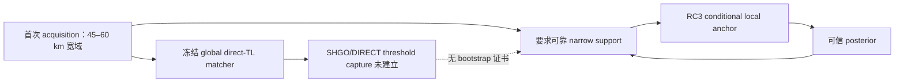

# R1 冷启动循环依赖审计

结论：如果把“上一时刻已定位好的 posterior”作为当前 acquisition 的隐含初始化，而该 posterior 又要由已失败的 wide-domain direct-TL global matcher 产生，则出现 `COLD_START_CIRCULAR_DEPENDENCY`。

本轮机器字段 `circular_dependency_present=true` 只标记这个被审计的 acquisition bootstrap 分支。R1 尚无实现；不是发现现有代码循环 bug，不是说所有合法 prior 或 tracking 都必然循环。前轮 closeout 已将它写为未解决前置条件，本轮没有把旧提案改写成已实现系统。

| 被提出的起步来源 | 审计结果 | 原因 |
|---|---|---|
| truth 或 oracle acoustic basin | DISALLOWED | privileged initialization，不能供 estimator 使用 |
| FIX2 recovered state | DISALLOWED_FOR_COLD_START | 已看 matched development 解不是当前未知目标的观测派生 prior |
| 人工窄 range prior | UNJUSTIFIED | 无当前场景合法观测与宽度/保留率证据 |
| 假设前一时刻已定位好 | CIRCULAR_IF_USED_TO_JUSTIFY_ACQUISITION | 第一个可信 support 的来源仍未回答 |
| 当前失败的 SHGO/DIRECT wide global matcher | NO_VALID_BOOTSTRAP_ESTABLISHED | 冻结 21 nominal cases 各 solver 各 budget 0/21，raw convergence 0/21 |
| 第一 CZ 标签直接变成精确距离 | UNESTABLISHED | RC1 正式角色为 45–60 km 条件域，没有更窄 prior admission |
| 来自独立 acquisition 的可信 support | ACYCLIC_BUT_CONDITIONAL | 可定义 tracking 接口；该 acquisition 未在当前路线内建立，不能暗中作为现有能力 |

无环 tracking 的条件结构可以是：合法独立 acquisition → 有来源及 coverage 的 joint support → prediction/candidate continuation → local RC3 → update。但起点是一个尚未满足的外部条件，不能改称本项目已经完成被动冷启动。

本轮只标记依赖，未开发 bootstrap、local optimizer 或新 acquisition observable。不能通过增加预算、重包装 global inversion 或使用 oracle 初始化“解除循环”。证据见 [acquisition/tracking 审计](R1_ACQUISITION_VS_TRACKING.md)、[tractability 冻结判定](../R4_A1_SEARCH_TRACTABILITY_AUDIT/DEVELOPMENT_FINAL_DECISION.json)。
